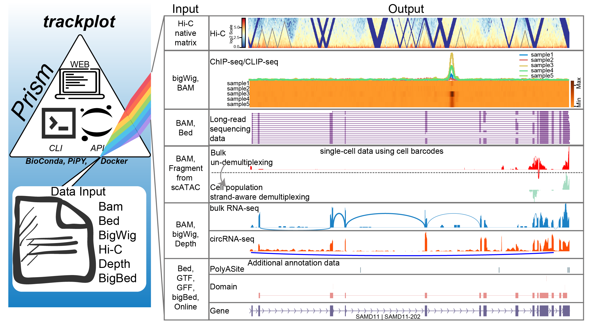

# trackplot

[](https://pypi.org/project/trackplot/)
[](https://pypi.org/project/trackplot/)
[](http://bioconda.github.io/recipes/trackplot/README.html)
[](https://trackplot.readthedocs.io/en/latest/)
[](https://www.gnu.org/licenses/agpl-3.0)
[](https://journals.plos.org/ploscompbiol/article?id=10.1371/journal.pcbi.1011477)

---



[Tutorials](https://trackplot.readthedocs.io/en/latest/)

## what is trackplot

trackplot is a tool for visualizing various next-generation sequencing (NGS) data, including DNA-seq, RNA-seq, single-cell RNA-seq and full-length sequencing datasets. 

### Features of trackplot

1. Support various file formats as input
2. Support strand-aware coverage plot
3. Visualize coverage by heatmap, including HiC diagram 
4. Visualize protein domain based the given gene id
5. Demultiplex the single-cell RNA/ATAC-seq which used cell barcode into cell population 
6. Support visualizing individual full-length reads in read-by-read style
7. Support visualize circRNA sequencing data

## Input

trackplot supports almost NGS data format, including

- BAM
- Bed
- Depth file generated by `samtools depth`
- bigBed [[pyBigWig](https://github.com/deeptools/pyBigWig) optional]
- bigWig [[pyBigWig](https://github.com/deeptools/pyBigWig) optional]
- naive Hi-C format [[hicmatrix](https://github.com/deeptools/HiCMatrix) optional]


## Output

The output will be a pdf and other image file formats which satisfy the requirement of the major journals, 
and each track on output corresponds these datasets from config file.

## Usage

Trackplot is based on **Python3** `(python_requires='>=3.8')`, 
and we have simplified the installation process on the main page. 
For a more comprehensive installation guide, please refer to [this link](./docs/installation.md).

### For impatient

```shell
pip install trackplot
trackplot --help

# or using trackplot by conda

conda create -n trackplot -c bioconda -c conda-forge trackplot
conda activate trackplot
trackplot --help

```

###### Notes
>1. For users on **Microsoft Windows**, **Mac (Apple Silicon)**, 
    and **other ARM platforms**, 
    please note that Trackplot may not be installable via PyPI or Conda due to compatibility issues with pysam, 
    pybigwig, and hicmatrix libraries on these platforms. 
    As an alternative, we recommend using the Docker image for installation.

>2. If you encounter a `segment fault` error during multiple processing, 
    you may want to consider using the Docker image or running the command with the `-p 1` flag. 

>3. If you encounter the message `Please install pyBigWig and hicmatrix`, 
    you can refer to the official documentation for [pyBigWig](https://github.com/deeptools/pyBigWig) and 
    [hicmatrix](https://github.com/deeptools/HiCMatrix) to fulfill their requirements and resolve the issue.

<details><summary>Using trackplot by a command line (click me) </summary>
<p>


1. install from PyPi 

Before running this command line, please check python (>=3.8) was installed.

```bash
pip install trackplot
# __Note:__ We noticed some pypi mirrors are not syncing some packages we depend on, 
# therefore please try another pypi mirror once you encounter 
# `No local packages or working download links found for xxx`
```

---

2. [AppImage](https://github.com/ygidtu/trackplot/releases) (Linux/WSL x86_64 platform only)

For a binary version of the tool and more comprehensive information, please visit [this link](./docs/installation.md).

```bash
# example with version v0.3.5, please using your interested version according to your needs
export VERSION=0.3.5
chmod +x trackplot-${VERSION}-x86_64.AppImage
./trackplot-${VERSION}-x86_64.AppImage --help
```

---

3. using docker image

```bash
docker pull ygidtu/trackplot
docker run --rm ygidtu/trackplot --help
```

---


4. install from bioconda

```bash
# install trackplot into the default conda env 
conda install -c bioconda -c conda-forge trackplot

# or install trackplot into an isolated environments
conda create -n trackplot -c bioconda -c conda-forge trackplot

# activate the trackplot environment and execute the command line tool
conda activate trackplot
trackplot --help
```


</p>
</details>


---
<details><summary>Using trackplot by a local webserver (click me) </summary>
<p>


1. [AppImage](https://github.com/ygidtu/trackplot/releases) (Linux/WSL x86_64 only)

```bash
# example with version v0.3.3, please using your interested version according to your needs
export VERSION=0.3.3
gunzip trackplot-${VERSION}-x86_64.AppImage
chmod +x trackplot-${VERSION}-x86_64.AppImage
./trackplot-${VERSION}-x86_64.AppImage --help

# startup webserver
./trackplot-${VERSION}-x86_64.AppImage --start-server --host 0.0.0.0 --port 5000 --plots ./plots
```
    
**Note:** the `--plots` were required while using appimages

---

2. Running using command line

```bash
trackplot --start-server --host 0.0.0.0 --port 5000 --plots ./plots
```

3. Running using docker image

```bash
docker pull ygidtu/trackplot

# Deploy the server
docker run --name trackplot \
  --rm -v $PWD/example:/data -v $PWD/plots/:/plots -p 5000:5000 ygidtu/trackplot \
  --start-server \
  --host 0.0.0.0 \
  --data /data \
  --plots /plots
```

`-p`: public and private port for the server, default:5000(public):5000(private)
- `-v`, `--volume`: mount the working directory to docker container, for example, the `$PWD/data` could replace by the path to your directory contains all necessary data
- `--user`: prevent docker read and write file using root privileges

</p>
</details>

---

## Example

The `example` folder is downloaded from [here.](https://github.com/ygidtu/trackplot/archive/refs/heads/main.zip) 
And a more detailed tutorial could be found at [here.](https://trackplot.readthedocs.io/en/latest/)  

```bash
# example of basic plot types
trackplot \
  -e chr1:1270656-1284730:+ \
  -r example/example.sorted.gtf.gz \
  --interval example/interval_list.tsv \
  --density example/density_list.tsv \
  --show-junction-num \
  --igv example/igv.tsv \
  --heatmap example/heatmap_list.tsv \
  --focus 1272656-1272656:1275656-1277656 \
  --stroke 1275656-1277656:1277856-1278656@blue \
  --sites 1271656,1271656,1272656 \
  --line example/line_list.tsv \
  -o example.png \
  --dpi 300 \
  --width 10 \
  --height 1 \
  --barcode example/barcode_list.tsv \
  --domain --remove-duplicate-umi \
  --normalize-format cpm \
  --annotation-scale .3 \
  -p 4
```

if trackplot was installed by docker, here is the cmd

```bash
## The absolute path is required in Docker env.
 
cat $PWD/example/interval_list.tsv |grep -v '^#' | while read line; do echo $PWD/${line}; done > $PWD/example/interval_list.abspath.tsv
cat $PWD/example/density_list.tsv |grep -v '^#' | while read line; do echo $PWD/${line}; done > $PWD/example/density_list.abspath.tsv
cat $PWD/example/igv.tsv |grep -v '^#' | while read line; do echo $PWD/${line}; done > $PWD/example/igv.abspath.tsv
cat $PWD/example/heatmap_list.tsv |grep -v '^#' | while read line; do echo $PWD/${line}; done > $PWD/example/heatmap_list.abspath.tsv

docker run -v $PWD:$PWD -w $PWD --rm ygidtu/trackplot \
  -e chr1:1270656-1284730:+ \
  -r $PWD/example/example.sorted.gtf.gz \
  --interval $PWD/example/interval_list.tsv \
  --density $PWD/example/density_list.tsv \
  --show-junction-num \
  --igv $PWD/example/igv.tsv \
  --heatmap $PWD/example/heatmap_list.tsv \
  --focus 1272656-1272656:1275656-1277656 \
  --stroke 1275656-1277656:1277856-1278656@blue \
  --sites 1271656,1271656,1272656 \
  --line $PWD/example/line_list.tsv \
  -o example.png \
  --dpi 300 \
  --width 10 \
  --height 1 \
  --barcode $PWD/example/barcode_list.tsv \
  --domain --remove-duplicate-umi \
  --normalize-format cpm \
  --annotation-scale .3 \
  -p 4

```

here is the [output file](https://raw.githubusercontent.com/ygidtu/trackplot/main/example/example.png).


## Questions

Visit [issues](https://github.com/ygidtu/trackplot/issues) or 
contact [Yiming Zhang](https://github.com/ygidtu) or 
[Ran Zhou](https://github.com/zhou-ran)

## Citation

If you use the tool in your publication, please cite by

[Zhang Y, Zhou R, Liu L, et al. Trackplot: A flexible toolkit for combinatorial analysis of genomic data[J]. PLoS computational biology, 2023, 19(9): e1011477.](https://journals.plos.org/ploscompbiol/article?id=10.1371/journal.pcbi.1011477)
