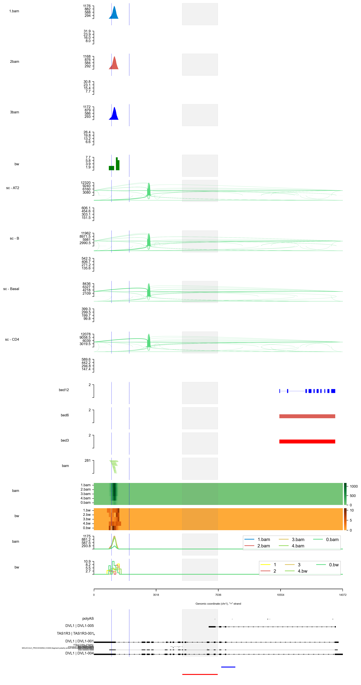

# sashimi.py

[See more example](https://sashimi.readthedocs.io/en/latest/)

## what is sashimi.py

sashimi.py is a tool for visualizing various next-generation sequencing (NGS) data, including DNA-seq, RNA-seq, single-cell RNA-seq and full-length sequencing datasets. 

### Features of sashimi.py

1. Support various file formats as input
2. Support strand-aware coverage plot
3. Visualize coverage by heatmap, including HiC diagram 
4. Visualize protein domain based the given gene id
5. Demultiplex the single-cell RNA/ATAC-seq which used cell barcode into cell population 
6. Support visualizing individual full-length reads in IGV-like style
7. Support visualize circRNA sequencing data

## Input

sashimi.py supports almost NGS data format, including

- BAM
- Bed
- bigBed
- bigWig
- Depth file generated by `samtools depth`
- naive HiC format


## Output

The output will be a pdf and other image file formats which satisfy the requirement of the major journals, 
and each track on output corresponds these datasets from config file.

## Usage

The sashimi.py is written in Python, and user could install it in a variety of ways as follows
1. install from pipy

   ```bash
   pip install sashimi.py
   
   # or install from source
   python setup.py install
   
   sashimipy --help
   ```
2. using docker image
    ```bash
    docker pull ygidtu/sashimi
    docker run --rm ygidtu/sashimi --help
    ```
   or 

    ```bash
    git clone from https://github.com/ygidtu/sashimi.py sashimi
    cd sashimi
    docker build -t ygidtu/docker .
    docker run --rm ygidtu/sashimi --help
    ```

3. install from source code

    ```bash
    git clone https://github.com/ygidtu/sashimi.py sashimi
    cd sashimi
    python setup.py install
    
    sashimipy --help
    # pr
    python main.py --help
    ```
   
4. running from a local webserver
    
   ```bash
    git clone https://github.com/ygidtu/sashimi.py sashimi
    cd sashimi/web

    # build the frontend static files
    npm install -g vue-cli vite && npm install
    vite build

    # prepare the backend server
    pip install fastapi pydantic jinja2 uvicorn

    python server.py --help
    ```

5. for `pipenv` users

    ```bash
    git clone https://github.com/ygidtu/sashimi.py
    cd sashimi.py
    pipenv install   # create virtualenv and install required packages
    pipenv shell   # switch to virtualenv
    
    sashimipy --help
    # pr
    python main.py --help

    ```


## Example

```bash
python main.py \
  -e chr1:1270656-1284730:+ \
  -r example/example.sorted.gtf.gz \
  --interval example/interval_list.tsv \
  --density example/density_list.tsv \
  --show-side \
  --igv example/igv.tsv \
  --heatmap example/heatmap_list.tsv \
  --focus 1272656-1272656:1275656-1277656 \
  --stroke 1275656-1277656:1277856-1278656@blue \
  --sites 1271656,1271656,1272656 \
  --line example/line_list.tsv \
  -o example/example.png \
  --dpi 300 \
  --width 10 \
  --height 1 \
  --barcode example/barcode_list.tsv \
  --domain --remove-duplicate-umi
```



## Questions

Visit [issues](https://github.com/ygidtu/sashimi.py/issues) or 
contact [Yiming Zhang](https://github.com/ygidtu) and 
[Ran Zhou](https://github.com/zhou-ran)

## Citation

The citation will be available as soon as possible.
