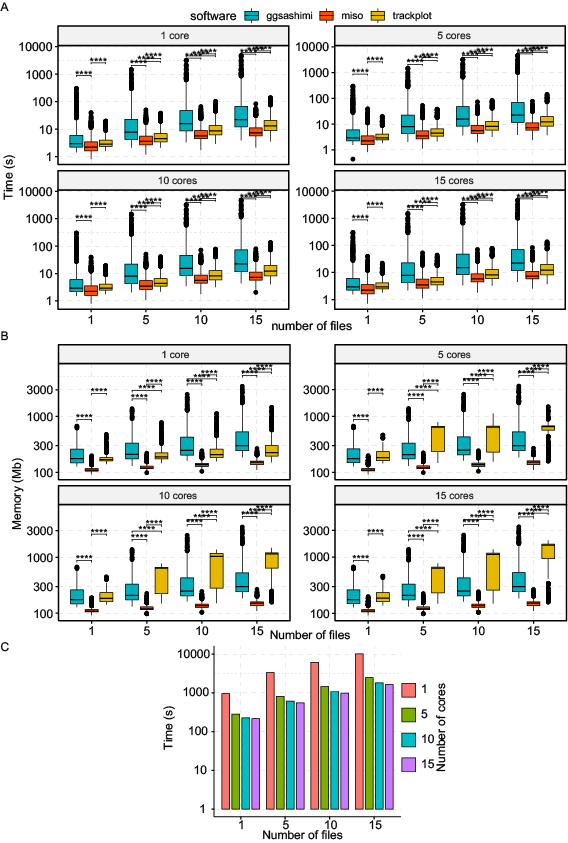

# Benchmark pipeline

This README.md documented how we perform speed and memory usage benchmark 
between [trackplot](https://github.com/ygidtu/trackplot), [misopy](https://miso.readthedocs.io/en/fastmiso/) and [ggsashimi](https://github.com/guigolab/ggsashimi)

In this benchmark, we ran miso in isoform-centric mode, 
and tested the performance of sashimi_plot using the whole gene region with default parameters 


---

## Setup testing environments

### Required command line tools
- For building test environments
  - [conda](https://docs.conda.io/en/latest/)
  - [git](https://git-scm.com)
- For prepare example datasets
  - wget
  - tar
  - zcat
  - [STAR](https://github.com/alexdobin/STAR)
  - [bgzip](http://www.htslib.org/doc/bgzip.html)
  - [tabix](http://www.htslib.org/doc/tabix.html)
  - [samtools](http://www.htslib.org)
  - [bedtools](https://bedtools.readthedocs.io/en/latest/)
  - [cellranger](https://support.10xgenomics.com/single-cell-gene-expression/software/pipelines/latest/installation)
- For benchmark
  - time: required by cmdbench, please install through `sudo apt install time` or `sudo yum install time`
- For plot
  - [R](https://www.r-project.org)
  - [ggplot2](https://ggplot2.tidyverse.org)
  - [ggpubr](https://rpkgs.datanovia.com/ggpubr/)
  - [cowplot](https://cran.r-project.org/web/packages/cowplot/vignettes/introduction.html)
  - [reshape2](https://cran.r-project.org/web/packages/reshape2/index.html)

### Setup benchmark python environment

Three python packages were required

- cmdbench: `pip install cmdbench`
- click: `pip install click`
- pysam: `pip install pysam`

```bash
git clone https://github.com/ygidtu/trackplot.git trackplot

cd trackplot/bench

pip install -r requirements.txt

# Test the running env
python main.py -h 
```

Then the parameters should be showed in terminal:
```bash
Usage: main.py [OPTIONS]

Options:
  -i, --infile PATH           Path to filelist with three columns, 1st path to
                              bam; 2nd alias of bam; 3rd color of bam.
                              [required]
  -o, --output PATH           Path to output directory.  [required]
  -g, --reference TEXT        Prefix of gtf and gff3.
  -e, --event TEXT            comma seperated gene ids  [default:
                              ENSG0000022397,ENSG0000022723]
  -r, --repeat INTEGER RANGE  How many files to generated.  [default: 6; x>=1]
  -n, --n-jobs INTEGER RANGE  How many processes to use.  [default: 1; x>=1]
  -h, --help                  Show this message and exit.
```

### Setup several plotting packages

1. Setup trackplot
   ```bash
   conda create -n trackplot -y -c conda-forge python=3.10
   
   # activate and install trackplot
   conda activate trackplot
   pip install trackplot
   
   # test trackplot installation
   trackplot --version
   conda deactivate
   ```

2. Setup [misopy](https://miso.readthedocs.io/en/fastmiso/)
   ```bash
   conda create -n misopy -y -c bioconda misopy
   
   # activate and test misopy installation
   conda activate misopy && index_gff --help && miso --help
   conda deactivate
   ```

3. Setup [ggsashimi](https://github.com/guigolab/ggsashimi)
   ```bash
   # using python 3.10 to set same python version with trackplot
   conda create -n ggsashimi -y -c conda-forge -c bioconda r-base python=3.10
   
   conda activate ggsashimi
   
   # install R requirements
   Rscript -e "install.packages(c('ggplot2', 'data.table', 'gridExtra'))"
   
   # install python requirements
   pip install pysam
   
   # install ggsashimi.py script
   wget -c -P $(dirname $(which R)) https://raw.githubusercontent.com/guigolab/ggsashimi/master/ggsashimi.py
   chmod +x $(dirname $(which R))/ggsashimi.py
   
   # test ggsashimi.py installation
   ggsashimi.py --version
   Rscript -e "packageVersion('ggplot2')"
   Rscript -e "packageVersion('data.table')"
   Rscript -e "packageVersion('gridExtra')"
   conda deactivate
   ```


---

### Prepare example data

1. Download raw data
   We used the [GSM1267847](https://www.ncbi.nlm.nih.gov/geo/query/acc.cgi?acc=GSM1267847) datasets for number of input files.

   - `SRR1032173`: HEK293_Control_R1
   - `SRR1032174`: HEK293_Control_R2
   - `SRR1032175`: Stau1_KnockDown_R1
   - `SRR1032176`: Stau1_KnockDown_R2
   - `SRR1032177`: Stau1_Overexpression_R1
   - `SRR1032178`: Stau1_Overexpression_R2

   ```bash
   mkdir fastq && cd fastq
   wget -c ftp://ftp.sra.ebi.ac.uk/vol1/fastq/SRR103/003/SRR1032173/SRR1032173.fastq.gz
   wget -c ftp://ftp.sra.ebi.ac.uk/vol1/fastq/SRR103/004/SRR1032174/SRR1032174.fastq.gz
   wget -c ftp://ftp.sra.ebi.ac.uk/vol1/fastq/SRR103/005/SRR1032175/SRR1032175.fastq.gz
   wget -c ftp://ftp.sra.ebi.ac.uk/vol1/fastq/SRR103/006/SRR1032176/SRR1032176.fastq.gz
   wget -c ftp://ftp.sra.ebi.ac.uk/vol1/fastq/SRR103/007/SRR1032177/SRR1032177.fastq.gz
   wget -c ftp://ftp.sra.ebi.ac.uk/vol1/fastq/SRR103/008/SRR1032178/SRR1032178.fastq.gz
   
   cd ..
   ```

2. Prepare reference and STAR index
   ```bash
   mkdir ref && cd ref
   wget -c https://ftp.ensembl.org/pub/release-101/gtf/homo_sapiens/Homo_sapiens.GRCh38.101.chr.gtf.gz
   wget -c https://ftp.ensembl.org/pub/release-101/gff3/homo_sapiens/Homo_sapiens.GRCh38.101.chr.gff3.gz
   wget -c https://ftp.ensembl.org/pub/release-101/fasta/homo_sapiens/dna/Homo_sapiens.GRCh38.dna.primary_assembly.fa.gz
   
   # generate STAR index
   zcat Homo_sapiens.GRCh38.dna.primary_assembly.fa.gz > Homo_sapiens.GRCh38.dna.primary_assembly.fa
  
   STAR --runThreadN 20 \
      --runMode genomeGenerate \
      --genomeDir STAR_index \
      --genomeFastaFiles Homo_sapiens.GRCh38.dna.primary_assembly.fa \
      --sjdbGTFfile Homo_sapiens.GRCh38.101.chr.gtf \
      --sjdbOverhang 99
   
   # generate cellranger index
   cellranger mkref --nthreads=20 --genome=Homo_sapiens --genes =Homo_sapiens.GRCh38.101.chr.gtf.gz --fasta=Homo_sapiens.GRCh38.dna.primary_assembly.fa.gz
   rm Homo_sapiens.GRCh38.101.chr.gtf Homo_sapiens.GRCh38.dna.primary_assembly.fa
   
   # sort gtf and create tabix index
   bedtools sort -i Homo_sapiens.GRCh38.101.chr.gtf.gz | bgzip > Homo_sapiens.GRCh38.101.chr.sorted.gtf.gz
   tabix -p gff Homo_sapiens.GRCh38.101.chr.sorted.gtf.gz
   
   # sort gff and create tabix index
   bedtools sort -i Homo_sapiens.GRCh38.101.chr.gff3.gz | bgzip > Homo_sapiens.GRCh38.101.chr.sorted.gff3.gz
   tabix -p gff Homo_sapiens.GRCh38.101.chr.sorted.gff3.gz
   
   cd ..
   ```

3. Alignment to human genome (hg38, ensembl release 101) 
    ```bash
    mkdir STAR
    STAR --genomeLoad LoadAndExit --genomeDir ref/STAR_index
    for i in $(/bin/ls fastq/SRR*.fastq.gz);
    do
        echo $i
        fn=$(basename $i)
        STAR --runThreadN 20 \
            --outSAMtype BAM SortedByCoordinate \
            --outBAMcompression 9 \
            --limitBAMsortRAM 100000000000 \
            --readFilesCommand zcat \
            --genomeDir ref/STAR_index \
            --genomeLoad LoadAndKeep --readFilesIn $i \
            --outFileNamePrefix STAR/${fn/".fastq.gz"/""}.
    done
    STAR --genomeLoad Remove --genomeDir ref/STAR_index
    ```
   
4. To test whether all scripts and conda environments were properly setup
   
   1. Miso
   The `miso.txt` should be 3 columns tab seperated list, including path to bam, alias of bam and color

    ```bash
    ./STAR/SRR1032173.Aligned.sortedByCoord.out.bam  HEK293_Control_R1     #CC0011
    ./STAR/SRR1032174.Aligned.sortedByCoord.out.bam  HEK293_Control_R2     #CC0011
    ./STAR/SRR1032175.Aligned.sortedByCoord.out.bam  Stau1_KnockDown_R1    #FF8800
    ./STAR/SRR1032176.Aligned.sortedByCoord.out.bam  Stau1_KnockDown_R2    #FF8800
    ./STAR/SRR1032177.Aligned.sortedByCoord.out.bam  Stau1_Overexpression_R1       #0080FF
    ./STAR/SRR1032178.Aligned.sortedByCoord.out.bam  Stau1_Overexpression_R2       #0080FF
    ```
   
   Then run and get execution time and max memory usage in terminal
    ```bash
    python run_miso.py -g ./ref/Homo_sapiens.GRCh38.101.chr.sorted.gff3.gz -e gene:ENSG00000186007 -o miso -b miso.txt
    # execution_time=39.83; max_memory=137523200
    ```

   2. trackplot
   
   The `trackplot.txt` should be 4 columns tab seperated list, including path to bam, file type, alias of bam and color

    ```bash
    ./STAR/SRR1032173.Aligned.sortedByCoord.out.bam  bam     HEK293_Control_R1     #CC0011
    ./STAR/SRR1032174.Aligned.sortedByCoord.out.bam  bam     HEK293_Control_R2     #CC0011
    ./STAR/SRR1032175.Aligned.sortedByCoord.out.bam  bam     Stau1_KnockDown_R1    #FF8800
    ./STAR/SRR1032176.Aligned.sortedByCoord.out.bam  bam     Stau1_KnockDown_R2    #FF8800
    ./STAR/SRR1032177.Aligned.sortedByCoord.out.bam  bam     Stau1_Overexpression_R1       #0080FF
    ./STAR/SRR1032178.Aligned.sortedByCoord.out.bam  bam     Stau1_Overexpression_R2       #0080FF
    ```
   
   Then run and get execution time and max memory usage in terminal
    ```bash
    python run_trackplot.py  -g ./ref/Homo_sapiens.GRCh38.101.chr.sorted.gtf.gz -e ENSG00000186007 -o trackplot -b trackplot.txt
    # execution_time=6.88; max_memory=696979456
    ```
   
   3. ggsashimi
  
   The `ggsashimi.txt` should be 3 columns tab seperated list, including alias of bam, path to bam, and color

    ```bash
    HEK293_Control_R1     ./STAR/SRR1032173.Aligned.sortedByCoord.out.bam  #CC0011
    HEK293_Control_R2     ./STAR/SRR1032174.Aligned.sortedByCoord.out.bam  #CC0011
    Stau1_KnockDown_R1    ./STAR/SRR1032175.Aligned.sortedByCoord.out.bam  #FF8800
    Stau1_KnockDown_R2    ./STAR/SRR1032176.Aligned.sortedByCoord.out.bam  #FF8800
    Stau1_Overexpression_R1       ./STAR/SRR1032177.Aligned.sortedByCoord.out.bam  #0080FF
    Stau1_Overexpression_R2       ./STAR/SRR1032178.Aligned.sortedByCoord.out.bam  #0080FF
    ```
   
   Then run and get execution time and max memory usage in terminal
    ```bash
    python run_ggsashimi.py  -g ./ref/Homo_sapiens.GRCh38.101.chr.sorted.gtf.gz -e ENSG00000186007 -o ggsashimi -b ggsashimi.txt
    # execution_time=21.66; max_memory=324194304
    ```

   5. generate bam list for official benchmark
   - 1st column: path to bam file
   - 2nd column: alias of bam file
   - 3rd column: color of bam file
   
    The `bam_list.txt`
    ```bash
    ./STAR/SRR1032173.Aligned.sortedByCoord.out.bam        HEK293_Control_R1   #CC0011
    ./STAR/SRR1032174.Aligned.sortedByCoord.out.bam        HEK293_Control_R2   #CC0011
    ./STAR/SRR1032175.Aligned.sortedByCoord.out.bam        Stau1_KnockDown_R1  #FF8800
    ./STAR/SRR1032176.Aligned.sortedByCoord.out.bam        Stau1_KnockDown_R2  #FF8800
    ./STAR/SRR1032177.Aligned.sortedByCoord.out.bam        Stau1_Overexpression_R1 #0080FF
    ./STAR/SRR1032178.Aligned.sortedByCoord.out.bam        Stau1_Overexpression_R2 #0080FF
    ```
   
    The `bam_list2.txt`
    ```bash
    ./C143/outs/possorted_genome_bam.bam        BALF_C143   #CC0011
    ```
    
    Then run and get the final statistic information in `benckmark/stats.txt`
    ```bash
    python main.py -i bam_list.txt -o benchmark -g ./ref/Homo_sapiens.GRCh38.101.chr.sorted
    ```
   
    The format of `stats.txt` should be
    ```bash
    event   time    memory  software        num_of_files    n_jobs
    ENSG0000022397  31.42   86331392        miso    6       1
    ENSG0000022397  35.95   253845504       trackplot       6       1
    ENSG0000022397  6.700000000000005       253845504       ggsashimi       6       1
    ENSG0000022723  80.27000000000002       253845504       miso    6       1
    ENSG0000022723  86.10000000000001       289869824       trackplot       6       1
    ENSG0000022723  21.92999999999999       289869824       ggsashimi       6       1
    ```

---

### Generate benchmark results

Increase the ulimit in your linux system
```bash
ulimit -n 4096
```

Run the following python code to generate benchmark results

```python
cmds = []
for i in range(0, 20, 5):
  for j in range(0, 20, 5):
    if i == 0:
      i = 1
    if j == 0:
      j = 1
    cmds.append(f"python main.py -i bam_list.txt -o benchmark_r{i}_n{j}/ -g ref/Homo_sapiens.GRCh38.101.chr --repeat {i} --n-jobs {j} --event 1000")

import os
from multiprocessing import Pool
with Pool(4) as p:
  p.map(os.system, cmds)
```

Run R code to check whether the benchmark results were properly generated and preview the benchmarking results.

```bash
Rscript plot.R
```

---

The benchmark results in our article.



