# Command line Usage

## Example

The following code is used to generate the example images.

```bash
python main.py \
  -e chr1:1270656-1284730:+ \
  -r example/example.sorted.gtf.gz \
  --density example/density_list.tsv \
  --show-site \
  --focus 1272656-1272656:1275656-1277656 \
  --stroke 1275656-1277656:1277856-1278656@blue \
  --sites 1271656,1271656,1272656 \
  --line example/line_list.tsv \
  -o example/example.png \
  --dpi 300 \
  --width 10 \
  --height 1 \
  --barcode example/barcode_list.tsv \
  --heatmap example/heatmap_list.tsv \
  --interval example/interval_list.tsv \
  --customized-junction example/junctions.tsv
```


## Command line arguments

List all the parameters

```bash
python main.py --help
# Or
sashimipy --help
```

Parameters:

```bash
Usage: main.py [OPTIONS]

  Welcome to use sashimi

Options:
  --version                       Show the version and exit.
  --debug                         enable debug level log
  -e, --event TEXT                Event range eg: chr1:100-200:+  [required]
  Common input files configuration:
    --color-factor INTEGER RANGE  Index of column with color levels (1-based);
                                  NOTE: LUAD|red -> LUAD while be labeled in
                                  plots and red while be the fill color
                                  [default: 1; x>=1]
    --barcode PATH                Path to barcode list file, At list two
                                  columns were required, - 1st The name of bam
                                  file;- 2nd the barcode;- 3rd The group
                                  label, optional;- 4th The color of each
                                  cell type, default using the color of
                                  corresponding bam file.
    --barcode-tag TEXT            The default cell barcode tag label
                                  [default: CB]
    --umi-tag TEXT                The default UMI barcode tag label  [default:
                                  UB]
    -p, --process INTEGER RANGE   How many cpu to use  [1<=x<=cpu_number]
    --group-by-cell               Group by cell types in density/line plot
    --remove-duplicate-umi        Drop duplicated UMIs by barcode
  Output settings:
    -o, --output PATH             Path to output graph file
    -d, --dpi INTEGER RANGE       The resolution of output file  [default:
                                  300; x>=1]
    --raster                      The would convert heatmap and site plot to
                                  raster image (speed up rendering and produce
                                  smaller files), only affects pdf, svg and PS
    --height FLOAT                The height of output file, default adjust
                                  image height by content  [default: 1]
    --width INTEGER RANGE         The width of output file, default adjust
                                  image width by content  [default: 10; x>=0]
    --backend TEXT                Recommended backend  [default: Agg]
  Reference settings:
    -r, --reference PATH          Path to gtf file, both transcript and exon
                                  tags are necessary
    --interval PATH               Path to list of interval files in bed
                                  format, 1st column is path to file, 2nd
                                  column is the label [optional]
    --show-id                     Whether show gene id or gene name
    --show-exon-id                Whether show gene id or gene name
    --no-gene                     Do not show gene id next to transcript id
    --domain                      Add domain information into reference track
    --proxy TEXT                  The http or https proxy for EBI/Uniprot
                                  requests,if `--domain` is True, eg:
                                  http://127.0.0.1:1080
    --timeout INTEGER RANGE       The requests timeout when `--domain` is
                                  True.  [default: 10; x>=1]
    --local-domain TEXT           Load local domain folder and load into
                                  reference track, download from https://hgdow
                                  nload.soe.ucsc.edu/gbdb/hg38/uniprot/
    --remove-empty                Whether to plot empty transcript
    --transcripts-to-show TEXT    Which transcript to show, transcript name or
                                  id in gtf file, eg: transcript1,transcript2
    --choose-primary              Whether choose primary transcript to plot.
    --ref-color TEXT              The color of exons  [default: black]
    --intron-scale FLOAT          The scale of intron  [default: 0.5]
    --exon-scale FLOAT            The scale of exon  [default: 1]
  Density plot settings:
    --density PATH                The path to list of input files, a tab
                                  separated text file,  - 1st column is path
                                  to input file, - 2nd column is the file
                                  category, - 3rd column is input file alias
                                  (optional), - 4th column is color of input
                                  files (optional), - 5th column is the
                                  library of input file (optional, only
                                  required by bam file).
    --customized-junction TEXT    Path to junction table column name needs to
                                  be bam name or bam alias.
    --only-customized-junction    Only used customized junctions.
    -t, --threshold INTEGER RANGE
                                  Threshold to filter low abundance junctions
                                  [default: 0; x>=0]
    --density-by-strand           Whether to draw density plot by strand
    --show-site                   Whether to draw additional site plot
    --site-strand [all|+|-]       Which strand kept for site plot, default use
                                  all  [default: all]
    --included-junctions TEXT     The junction id for including, chr1:1-100
    --show-junction-num           Whether to show the number of junctions
    --sc-density-height-ratio FLOAT
                                  The relative height of single cell density
                                  plots  [default: 1]
  Line plot settings:
    --line PATH                   The path to list of input files, a tab
                                  separated text file,  - 1st column is path
                                  to input file, - 2nd column is the file
                                  category, - 3rd column is input file group
                                  (optional), - 4th column is input file
                                  alias (optional),  - 5th column is color
                                  platte of corresponding group (optional).
    --hide-legend                 Whether to hide legend
    --legend-position TEXT        The legend position
    --legend-ncol INTEGER RANGE   The number of columns of legend  [x>=0]
  Heatmap plot settings:
    --heatmap PATH                The path to list of input files, a tab
                                  separated text file,  - 1st column is path
                                  to input file, - 2nd column is the file
                                  category, - 3rd column is input file group
                                  (optional), - 4th column is color platte
                                  of corresponding group.
    --clustering                  Enable clustering of the heatmap
    --clustering-method [single|complete|average|weighted|centroid|median|ward]
                                  The clustering method for heatmap  [default:
                                  ward]
    --distance-metric [braycurtis|canberra|chebyshev|cityblock|correlation|cosine|dice|euclidean|hamming|jaccard|jensenshannon|kulsinski|kulczynski1|mahalanobis|matching|minkowski|rogerstanimoto|russellrao|seuclidean|sokalmichener|sokalsneath|sqeuclidean|yule]
                                  The distance metric for heatmap  [default:
                                  euclidean]
    --heatmap-scale               Do scale on heatmap matrix.
    --heatmap-vmin INTEGER        Minimum value to anchor the colormap,
                                  otherwise they are inferred from the data.
    --heatmap-vmax INTEGER        Maximum value to anchor the colormap,
                                  otherwise they are inferred from the data.
    --show-row-names              Show row names of heatmap
    --sc-heatmap-height-ratio FLOAT
                                  The relative height of single cell heatmap
                                  plots  [default: 0.2]
  IGV settings:
    --igv PATH                    The path to list of input files, a tab
                                  separated text file,  - 1st column is path
                                  to input file, - 2nd column is the file
                                  category, - 3rd column is input file alias
                                  (optional), - 4th column is color of input
                                  files (optional) - 5th column is exon_id
                                  for sorting the reads (optional).
    --m6a TEXT                    Sashimi.py will load location information
                                  from the given tags and  then highlight
                                  the RNA m6a modification cite at individual
                                  reads.  If there are multiple m6a
                                  modification site, please add tag as follow,
                                   234423,234450
    --polya TEXT                  Sashimi.py will load length of poly(A) from
                                  the given tags and  then visualize the
                                  poly(A) part at end of each individual
                                  reads.
    --rs TEXT                     Sashimi.py will load real strand information
                                  of each reads from the given tags and  the
                                  strand information is necessary for
                                  visualizing poly(A) part.
    --del-ratio-ignore FLOAT RANGE
                                  Ignore the deletion gap in nanopore or
                                  pacbio reads. if a deletion region was
                                  smaller than (alignment length) *
                                  (del_ratio_ignore), then the deletion gap
                                  will be filled. currently the
                                  del_ratio_ignore was 1.0.  [0.0<=x<=1.0]
  HiC settings:
    --hic PATH                    The path to list of input files, a tab
                                  separated text file,  - 1st column is path
                                  to input file, - 2nd column is the file
                                  category, - 3rd column is input file alias
                                  (optional), - 4th column is color of input
                                  files (optional) - 5th column is data
                                  transform for HiC matrix, eg log1p, log2,
                                  log10 (optional).
  Additional annotation:
    -f, --genome PATH             Path to genome fasta
    --sites TEXT                  Where to plot additional indicator lines,
                                  comma separated int
    --stroke TEXT                 The stroke regions:
                                  start1-end1:start2-end2@color-label, draw a
                                  stroke line at bottom, default color is red
    --link TEXT                   The link: start1-end1:start2-end2@color,
                                  draw a link between two site at bottom,
                                  default color is blue
    --focus TEXT                  The highlight regions: 100-200:300-400
  Motif settings:
    --motif PATH                  The path to customized bedGraph file, first
                                  three columns is chrom, start and end site,
                                  the following 4 columns is the weight of
                                  ATCG.
    --motif-region TEXT           The region of motif to plot in start-end
                                  format
    --motif-width FLOAT           The width of ATCG characters  [default: 0.8]
  Layout settings:
    --n-y-ticks INTEGER RANGE     The number of ticks of y-axis  [x>=0]
    --distance-ratio FLOAT        distance between transcript label and
                                  transcript line  [default: 0.1]
    --reference-scale FLOAT       The size of reference plot in final plot
                                  [default: 0.25]
    --stroke-scale FLOAT          The size of stroke plot in final image
                                  [default: 0.25]
  Overall settings:
    --font-size INTEGER RANGE     The font size of x, y-axis and so on  [x>=1]
    --reverse-minus               Whether to reverse strand of bam/reference
                                  file
    --hide-y-label                Whether hide y-axis label
    --same-y                      Whether different sashimi/line plots shared
                                  same y-axis boundaries
    --log [0|2|10|zscore]         y axis log transformed, 0 -> not log
                                  transform; 2 -> log2; 10 -> log10
    --title TEXT                  Title
    --font TEXT                   Fonts
  -h, --help                      Show this message and exit.
```

## Detailed description

### Common options

1. `--color-factor`: the index of column to set colors

- basic usage: the input file list as follows,

```bash
path/to/bam1 LUAD
path/to/bam2 LUSC
```

Then the `--color-factor 2` means sashimi assign two colors to LUAD and LUSC separately automatically.  
   
- advanced usage:

```bash
path/to/bam1 LUAD|red
path/to/bam2 LUSC|#000000
```

Then the `--color-factor 2` means sashimi assign red color to LUAD and "#000000" to LUSC separately.  


### Output options

1. `-o, --output`: the path to output file, the common image format such as pdf, png, jpg and svg are supported.
2. `--backend`: the backend is used to switch matplotlib plotting backend,

**known issues: ** 

- the `Agg`, `PDF`, etc. backends may cause the small protein domains missing in final output image.
- the `Cairo` backend required `cairocffi` packages, 
  which may have difficulty to install for some users, 
  if then please try to use our docker image or use an alternative backend like `Agg/PDF`.

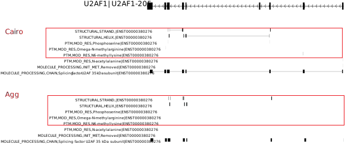

**Note:** `Cairo` backend may disable the heatmap rasterisation, so use as appropriate.

The recommended combination of backend and image formats please check [matplotlib backend](https://matplotlib.org/stable/users/explain/backends.html)

### Reference plot

1. `--domain`: fetch domain information from uniprot and ensemble, then map amino acid coordinate into genomic coordinate.

For each transcript, sashimi firstly get the uniprot id from [uniprot website]("https://rest.uniprot.org/uniprotkb/search?&query=ENST00000380276&format=xml") and check whether the length of protein is one third of CDS length. If yes, then fetch the uniprot information from [ebi](f"https://www.ebi.ac.uk/proteins/api/features/U2AF35a").


The sashimi will present these domains from ['DOMAIN_AND_SITES', 'MOLECULE_PROCESSING', 'PTM', 'STRUCTURAL', 'TOPOLOGY'] in default, and please refer [this](https://ebi-uniprot.github.io/ProtVista/userGuide.html) for the detail of each category.

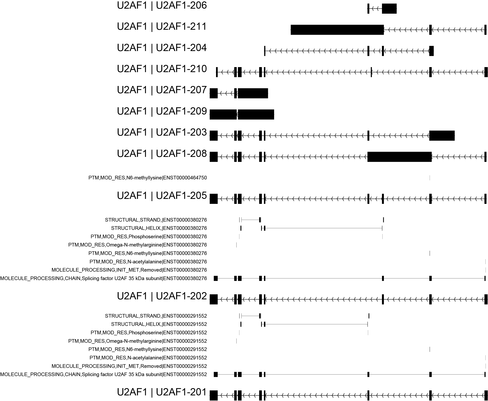

2. `--local-domain`: load domain information from a folder that contains bigbed files which download from [UCSC](https://hgdownload.soe.ucsc.edu/gbdb/hg38/uniprot/)

In order to facilitate these people from poor network regions, Sashimi also provides a local mode for domain visualization. First, the user must download the corresponding reference from UCSC, and collect all bigbed file into a folder which could pass to sashimi with `--local-domain`.

But the bigbed file from UCSC didn't provide a transcript or uniprot id, Sashimi couldn't map the protein information into the corresponding transcript id.

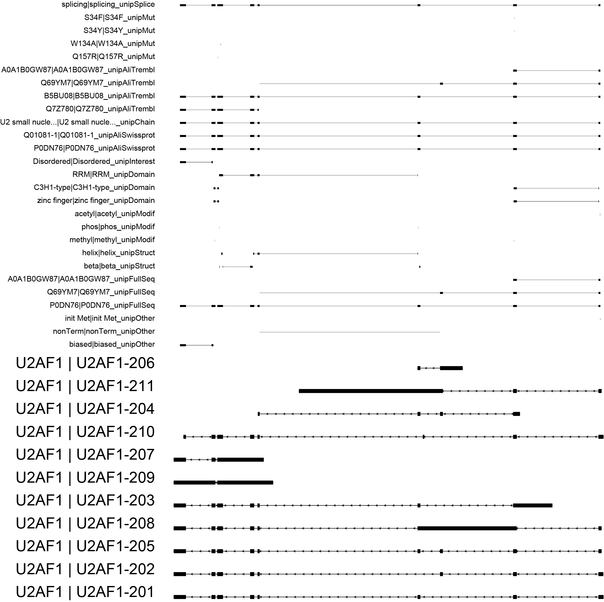

3. `--interval`: add additional feature track into reference.

In addition to fetch genomic feature from GTF or GFF file, Sashimi also provides a flexible way to load other features into reference track.
And user could prepare and record custom annotation information into a config file, like this

```bash
$ cat example/interval_list.tsv
#file_location  label_of_file
example/PolyASite.chr1.atlas.clusters.2.0.GRCh38.96.simple.bed.gz   polyAS 
```

Then Sashimi receive the custom annotation file with parameter `--interval`, the additional genomic features will be visualized at the reference track.

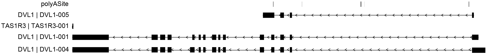

### Density plot

Density plot takes bam, bigwig or bgzipped depth file generated using samtools depth as input.

The input file list as follows

```bash
# filepath  file_category   label   color
example/bams/1.bam bam
example/bams/2.bam bam  2bam
example/bams/3.bam bam  3bam    blue
example/bws/2.bw    bw bw green
example/bams/sc.bam bam sc
```

1. `--customized-junction` 

This parameter is used to add user defined junctions

```bash
# junctions corresponding_input_file
junctions 2bam 3bam
chr1:1000-20000 100 200
```

- the row list different junctions.
- the columns corresponding to input files in file list.
- the table were filled with junction counts.

2. `--show-site` and `--show-strand`

These two parameters were used to show the density of reads starts by forward and reverse strand separately.

**Example: `--show-site`, `--focus` and `--sites` **

```bash
python main.py \
  -e chr1:1270656-1284730:+ \
  -r example/example.sorted.gtf.gz \
  --density example/density_list.tsv \
  --show-site \
  --focus 1272656-1272656:1275656-1277656 \
  --sites 1271656,1271656,1272656 \
  --output example.pdf
```

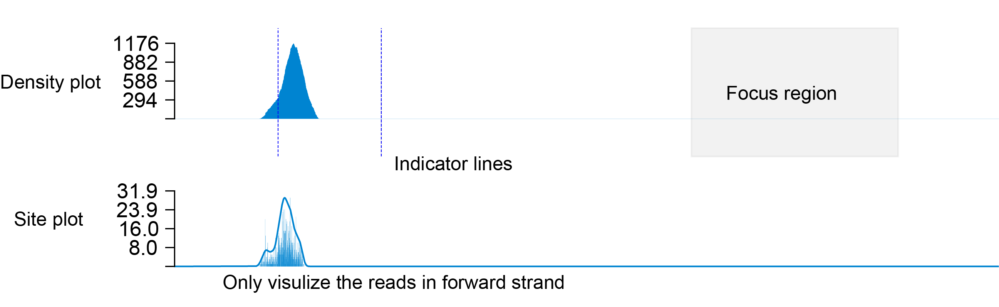


#### Single cell bam related parameters

1. `--barcode`

Provide a manually curated barcode list to separate bam files by cell types or other groups.
   
This barcode list as follows:

```bash
#bam  barcode cell_type(optional) cell_type(optional)
sc AAACCTGCACCTCGTT-1 AT2 #A6DCC2
sc AAAGATGTCCGAATGT-1 AT2 #A6DCC2
sc AAAGCAATCGTACGGC-1 AT2 #A6DCC2
```

2. `--barocde-tag` and `--umi-tag`

3. The tag to extract barcode and umi from each reads record, here we take the 10x Genomics bam format as default.

4. `--group-by-cell`

Group by cell types in density/line plot.

**Example: `--barcode` and `--group-by-cell`**

```bash
python main.py \
  -e chr1:1270656-1284730:+ \
  -r example/example.sorted.gtf.gz \
  --density example/density_list.tsv \
  --barcode example/barcode_list.tsv \
  --focus 1272656-1272656:1275656-1277656 \
  --sites 1271656,1271656,1272656 \
  --group-by-cell \
  --output example.pdf
```

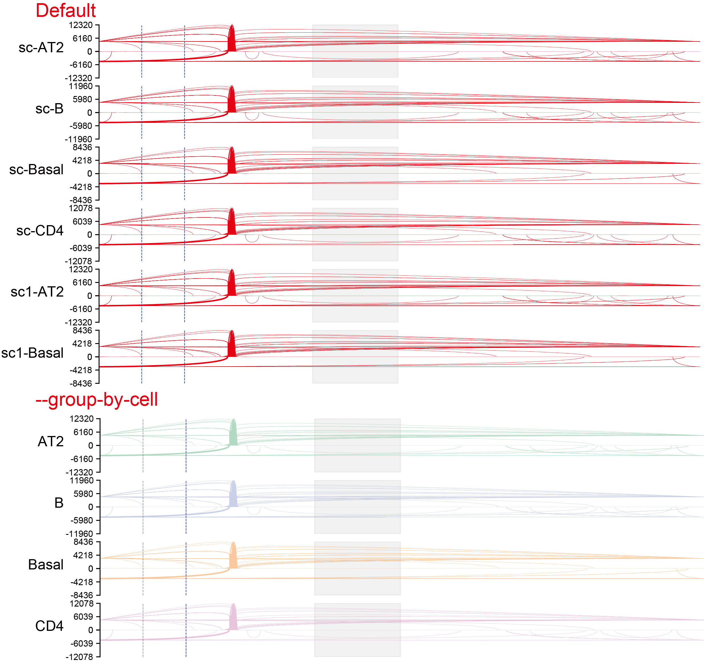
    

### Line plot

The line plot is simply another format of density plots.

The input file list as same as density plots


1. `--hide-legend`, `--legend-position` and `--legend-ncol`

These three parameters were used to disable legend, modify legend position and the columns of legend separately.

By default, the position of legend and columns of legend were determined by [matplotlib](https://matplotlib.org/), and the further detailed legend configuration please check [matplotlib legend](https://matplotlib.org/stable/api/_as_gen/matplotlib.pyplot.legend.html).

**Example: `--hide-legend` **

```bash
python main.py \
  -e chr1:1270656-1284730:+ \
  -o example/example_without_legend.png \
  --dpi 300 \
  --width 10 \
  --height 1 \
  --barcode example/barcode_list.tsv \
  --raster --density-by-strand \
  -r example/example.sorted.gtf.gz \
  --line example/line_list.tsv \
  --hide-legend
```


**Example: `--legend-position` and `--legend-ncol`**

```bash
python main.py \
  -e chr1:1270656-1284730:+ \
  -o example/example_with_legend.pdf \
  --dpi 300 \
  --width 10 \
  --height 1 \
  -t 100000 \
  --barcode example/barcode_list.tsv \
  --raster --density-by-strand \
  -r example/example.sorted.gtf.gz \
  --line example/line_list.tsv \
  --legend-position right \
  --legend-ncol 2
```

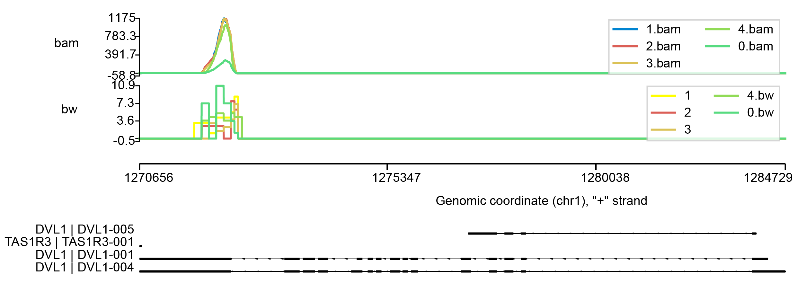


#### single cell bam related parameters

Please check the documentation in density plot.

### Heatmap plot

Heatmap plot takes bam or bigwig as input.

The input file list as follows

```bash
# filepath  file_category   group   color
example/bams/1.bam bam  bam
example/bams/2.bam bam  bam
example/bams/3.bam bam  bam
example/bams/4.bam bam  bam
example/bams/0.bam bam  bam
example/bws/1.bw    bw  bw  YlOrBr
example/bws/2.bw    bw  bw  YlOrBr
example/bws/3.bw    bw  bw  YlOrBr
example/bws/4.bw    bw  bw  YlOrBr
example/bws/0.bw    bw  bw  YlOrBr
```

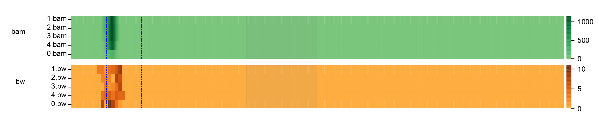


**Example: `--heatmap-scale`**

> Raw value

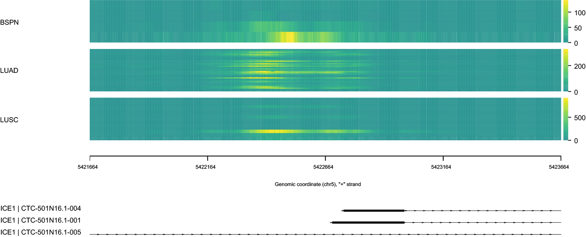

> Scaled value

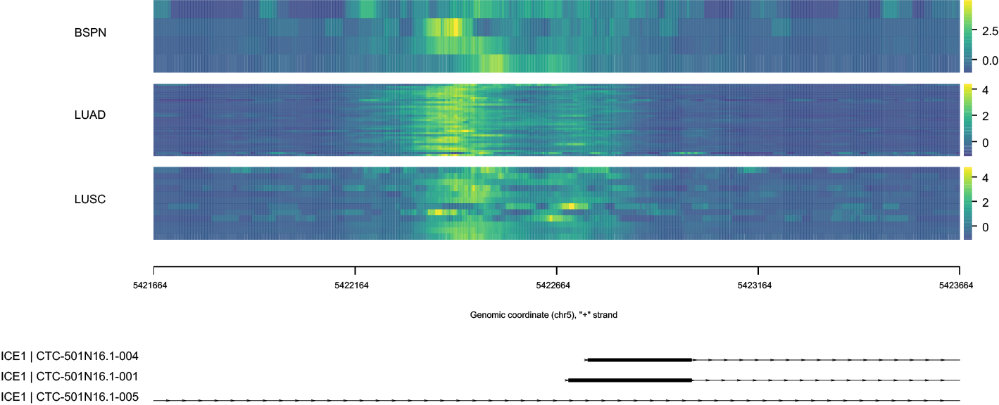


**Example: `--heatmap-vmin` and `--heatmap-vmax` to uniform color map **

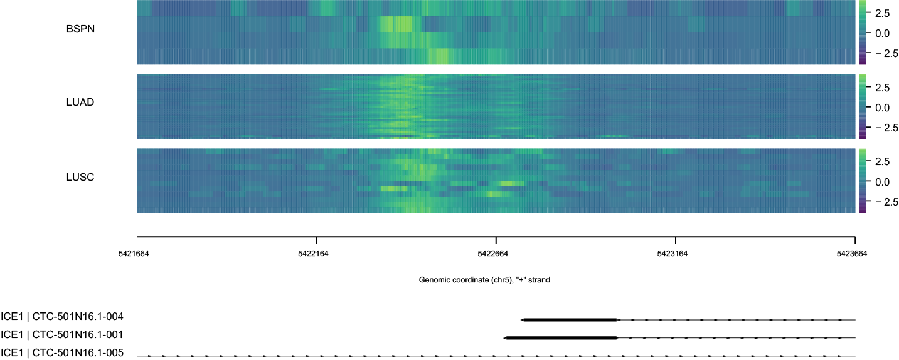


### Igv plot


1. Sashimi.igv module support different format file as input.

An Igv-like plot provides a landscape of aligned reads in a straight and convenient way. 

User could pass bed and bam file into Sashimi, and the input config file list as follows

```bash
#filepath	file_category	label	color
example/SRX9697989.corrected_reads.bed.gz	igv	bed12	blue
example/SRX9697989.corrected_reads.6.bed.gz	igv	bed6
example/SRX9697989.corrected_reads.3.bed.gz	igv	bed3	red
example/bams/0.bam	igv	bam
```

here is the plotting command line
```bash
python main.py \
  -e 1:10024601-10038168:+ \
  -r example/example.sorted.gtf.gz \
  --igv example/igv.tsv \
  -o test_igv_plot.1.pdf \
  --dpi 300 \
  --width 10 \
  --height 1

```

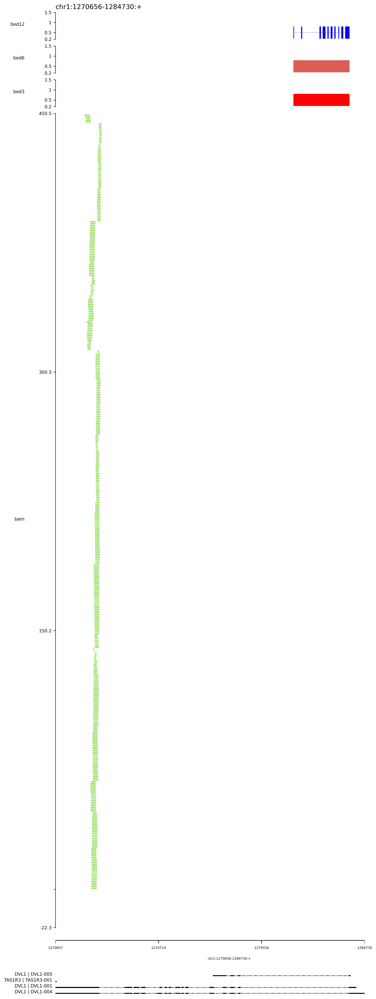

2. Sashimi.igv module load and visualize features from bam tags.

In this topic, Sashimi.igv could load m6A modification (tag, ma:i) and length of polyA (tag, pa:f) tag from bam file, and then present it on each reads.

Here is the subset bam information,

```bash

SRR12503063.3513161	16	1	14362	1	..	*	0	0	..	..	NM:i:197	ms:i:1177	AS:i:977	nn:i:0	ts:Z:+	tp:Z:P	cm:i:191	s1:i:837	s2:i:861	de:f:0.089	rl:i:41	pa:f:55.6556	rs:Z:-	ma:i:14368
SRR12503063.4180535	0	1	14363	48	..	*	0	0	..	..	NM:i:117	ms:i:636	AS:i:1093	nn:i:0	ts:Z:-	tp:Z:P	cm:i:245	s1:i:1045	s2:i:1023	de:f:0.0588	rl:i:0	pa:f:90.4319	rs:Z:-	ma:i:14372
SRR12503063.4171820	16	1	14363	51	..	*	0	0	..	..	NM:i:132	ms:i:700	AS:i:1191	nn:i:0	ts:Z:+	tp:Z:P	cm:i:257	s1:i:1182	s2:i:1152	de:f:0.0555	rl:i:0	pa:f:99.63	rs:Z:-	ma:i:14367
SRR12503063.8305358	16	1	14364	23	..	*	0	0	..	..	NM:i:285	ms:i:890	AS:i:716	nn:i:0	ts:Z:+	tp:Z:P	cm:i:99	s1:i:487	s2:i:466	de:f:0.1315	rl:i:33	pa:f:78.8698	rs:Z:-	ma:i:14368
SRR12503063.89603	16	1	14394	2	..	*	0	0	..	..	NM:i:220	ms:i:1064	AS:i:891	nn:i:0	ts:Z:+	tp:Z:P	cm:i:163	s1:i:740	s2:i:741	de:f:0.0992	rl:i:30	pa:f:66.8433	rs:Z:-	ma:i:14401
......

```

here is the command line,

```bash
 python main.py \
    -e chr1:13362-29900:+ \
    --igv example/igv.m6a.tsv \
    -o igv.m6a.pdf \
    --dpi 300 \
    --width 5 \
    --height 1 --rs rs --polya pa --m6a ma

```
In this picture, the red track and blue dot represents the length of poly(A) and m6a modification respectively,
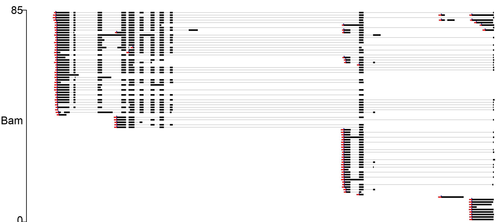

3. Sashimi.igv module also allow sort these reads by specific alternative exon

User could modify the config file as follows,

```bash
#filepath	file_category	label	color	focus_exon
example/SRX8994511.example.bed.gz	igv	bed12	blue	43100453-43100519,43101366-43101432
```

here is the command line for plotting

```bash
python main.py \
  -r Homo_sapiens.GRCh38.101.sorted.gtf.gz \
  -e 21:43092956-43107570:+ \
  --igv example/igv.3.tsv \
  --focus 43100453-43100519:43101366-43101432 \
  -o test_igv_plot.3.pdf \
  --dpi 300 \
  --width 6 \
  --height 1

```

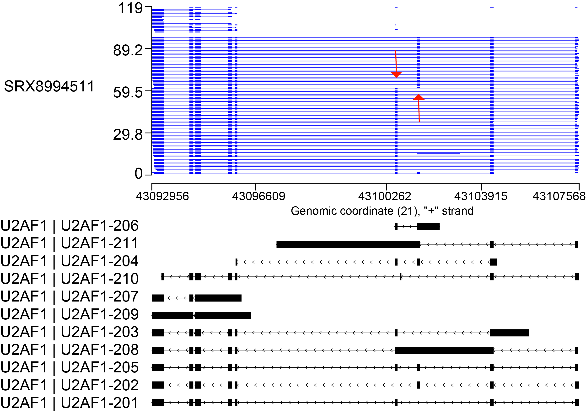

### HiC heatmap

#### HiC toy example 1

Sashimi also support HiC track, and user could prepare [Li_et_al_2015.h5](https://github.com/deeptools/HiCMatrix/blob/master/hicmatrix/test/test_data/Li_et_al_2015.h5) into a config file, then pass to `--hic`. here is an example config file,

```bash
# filepath  file_category   label   color  transform	depth
example/Li_et_al_2015.h5	hic	Li_hic	RdYlBu_r	log2	30000
```
here is the plotting command line

```bash
python main.py \
  -e X:2500000-3500000:+ \
  --hic example/hic.tsv \
  -o example.hic.png \
  --dpi 300 \
  --width 10 \
  --height 1
```

for each hic track, a bigger `depth` means a higher y-axis.  

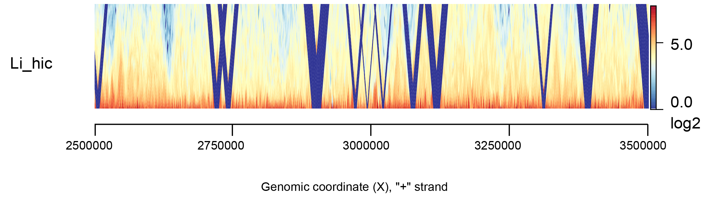

#### HiC toy example 2

Because `Li_et_al_2015.h5` doesn't contain chromosome 1, user could download a new toy dataset and add into example picture.

1. download hic file and convert into h5 format

```bash
wget https://encode-public.s3.amazonaws.com/2016/12/01/a241cba5-df2e-45fb-9a8f-5af5587fb02a/ENCFF121YPY.hic
hicConvertFormat -m ENCFF121YPY.hic --inputFormat hic --outputFormat cool -o ENCFF121YPY.cool --resolutions 1000
hicConvertFormat -m ENCFF121YPY_1000.cool --inputFormat cool --outputFormat h5 -o ENCFF121YPY.h5
```

If you met UnicodeDecodeError when converting hic into h5 format, you can download pairs format file from ENCODE.

Here is an example, 

```bash
wget https://www.encodeproject.org/files/ENCFF931NQV/@@download/ENCFF931NQV.pairs.gz
wget http://hgdownload.soe.ucsc.edu/goldenPath/hg38/bigZips/hg38.chrom.sizes
pairix ENCFF931NQV.pairs.gz
cooler cload pairix -p 16 hg38.chrom.sizes:1000 ENCFF931NQV.pairs.gz ENCFF931NQV_1kb.cool
hicConvertFormat -m ENCFF121YPY_1000.cool --inputFormat cool --outputFormat h5 -o ENCFF121YPY.h5
```

2. prepare the config file

```bash
# filepath  file_category   label   color  transform	depth
example/ENCFF718AWL.h5	hic	ENCFF718AWL	RdYlBu_r	log2	30000
```
3. run Sashimi

```bash
python main.py \
    -e chr1:1200000-1300000:+ \
    -r example/example.sorted.gtf.gz \
    --interval example/interval_list.tsv \
    --hic example/hic.2.tsv \
    -o hic.2.pdf \
    --dpi 300 \
    --width 10 \
    --height 1 \
    --domain
```
here is the [results](https://github.com/ygidtu/sashimi/blob/dev/example/hic.example.pdf).


## Motif plot

```bash
python main.py \
  -e chr1:1270656-1270776:+ \
  --density example/density_list.tsv \
  -o example/motif.pdf \
  --dpi 300 \
  --width 10 \
  --height 1 \
  --raster \
  -r example/example.sorted.gtf.gz \
  --motif example/motif.bed.gz \
  --motif-region 1270756-1270760
```
The motif weight matrix should be customized bedGraph format as follows:
```bash
# chromosome  start end A_weight T_weight C_weight G_weight
chr1  100 101 0.1 0.2 -0.3  -0.4 
```

Then, bgzipped && tabix indexed

here is the [results](imgs/cmd/motif.png).


### Additional annotation

We also provide multiple annotations, including indicator lines, focus, stroke and sequence.

**Example: `--focus`, `--sites` and `--stroke`**

```bash
python main.py \
  -e chr1:1270656-1284730:+ \
  --focus 1272656-1272656:1275656-1277656 \
  --stroke 1275656-1277656:1277856-1278656@blue \
  --sites 1271656,1271656,1272656 \
  -o example/example_additional.pdf \
  --dpi 300 \
  --width 10 \
  --height 1 \
  --raster \
  -r example/example.sorted.gtf.gz \
  --line example/line_list.tsv
```

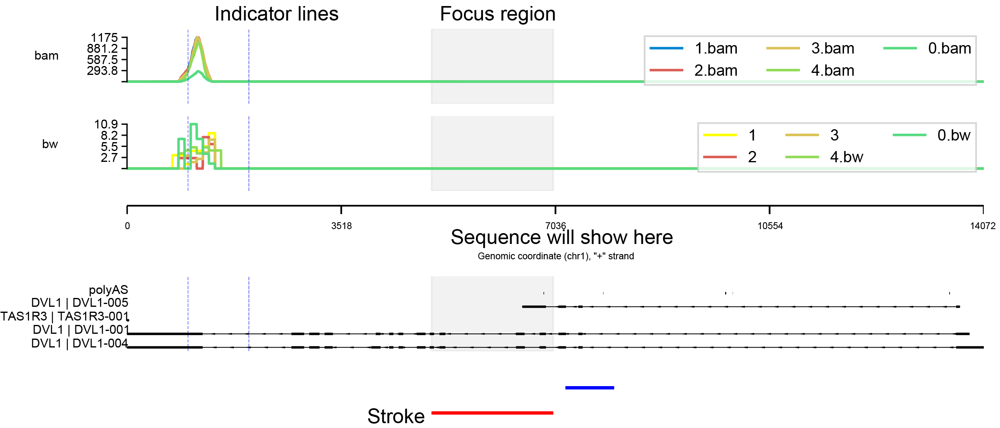