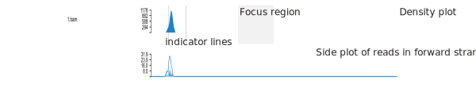
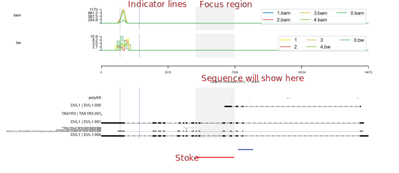

# Command line Usage

## Example

The following code is used to generate the example images.

```bash
python main.py \
  -e chr1:1270656-1284730:+ \
  -r example/example.sorted.gtf.gz \
  --density example/density_list.tsv \
  --show-side \
  --focus 1272656-1272656:1275656-1277656 \
  --stroke 1275656-1277656:1277856-1278656@blue \
  --sites 1271656,1271656,1272656 \
  --line example/line_list.tsv \
  -o example/example.png \
  --dpi 300 \
  --width 10 \
  --height 1 \
  --barcode example/barcode_list.tsv \
  --heatmap example/heatmap_list.tsv \
  --interval example/interval_list.tsv \
  --customized-junction example/junctions.tsv
```


## Command line arguments

List all the parameters

```bash
python main.py --help
# Or
sashimi --help
```

Parameters:

```bash
Usage: main.py [OPTIONS]                                                                                                                                      ✔  sashimi-Zgs4tuDQ Py │ base Py  13:15:04 

  Welcome to use sashimi

Options:
  --version                       Show the version and exit.
  --debug                         enable debug level log
  -e, --event TEXT                Event range eg: chr1:100-200:+  [required]
  Common input files configuration: 
    --color-factor INTEGER RANGE  Index of column with color levels (1-based);
                                  NOTE: LUAD|red -> LUAD while be labeled in
                                  plots and red while be the fill color
                                  [default: 1; x>=1]
    --barcode PATH                Path to barcode list file, At list two
                                  columns were required, - 1st The name of bam
                                  file;- 2nd the barcode;- 3rd The group
                                  label, optional.
    --barcode-tag TEXT            The default cell barcode tag label
                                  [default: CB]
    --umi-tag TEXT                The default UMI barcode tag label  [default:
                                  UB]
    -p, --process INTEGER RANGE   How many cpu to use  [1<=x<=12]
  Output settings: 
    -o, --output PATH             Path to output graph file
    -d, --dpi INTEGER RANGE       The resolution of output file  [default:
                                  300; x>=1]
    --raster                      The would convert heatmap and side plot to
                                  raster image (speed up rendering and produce
                                  smaller files), only affects pdf, svg and PS
    --height INTEGER RANGE        The height of output file, default adjust
                                  image height by content  [default: 0; x>=0]
    --width INTEGER RANGE         The width of output file, default adjust
                                  image width by content  [default: 0; x>=0]
    --backend TEXT                Recommended backend  [default: Cairo]
  Density plot settings: 
    --density PATH                The path to list of input files, a tab
                                  separated text file,  - 1st column is path
                                  to input file, - 2nd column is the file
                                  category, - 3rd column is input file alias
                                  (optional), - 4th column is color of input
                                  files (optional), - 5th column is the
                                  library of input file (optional, only
                                  required by bam file). 
    --customized-junction TEXT    Path to junction table column name needs to
                                  be bam name or bam alias.
    -t, --threshold INTEGER RANGE
                                  Threshold to filter low abundance junctions
                                  [default: 0; x>=0]
    --show-side                   Whether to draw additional side plot
    --side-strand [all|+|-]       Which strand kept for side plot, default use
                                  all  [default: all]
    --show-junction-num           Whether to show the number of junctions
  Reference settings: 
    -r, --reference PATH          Path to gtf file, both transcript and exon
                                  tags are necessary
    --interval PATH               Path to list of interval files in bed
                                  format, 1st column is path to file, 2nd
                                  column is the label [optional]
    --show-id                     Whether show gene id or gene name
    --show-exon-id                Whether show gene id or gene name
    --no-gene                     Do not show gene id next to transcript id
    --domain                      Add domain information into reference track
    --local-domain TEXT           Add local domain into reference track,
                                  download from https://hgdownload.soe.ucsc.ed
                                  u/gbdb/hg38/uniprot/
    --remove-empty                Whether to plot empty transcript
    --transcripts-to-show TEXT    Which transcript to show, transcript name or
                                  id in gtf file, eg: transcript1,transcript2
    --ref-color TEXT              The color of exons  [default: black]
    --intron-scale FLOAT          The scale of intron  [default: 0.5]
    --exon-scale FLOAT            The scale of exon  [default: 1]
  Heatmap plot settings: 
    --heatmap PATH                The path to list of input files, a tab
                                  separated text file,  - 1st column is path
                                  to input file, - 2nd column is the file
                                  category, - 3rd column is input file group
                                  (optional), - 4th column is color platte
                                  of corresponding group.
    --clustering                  Enable clustering of the heatmap
    --clustering-method [single|complete|average|weighted|centroid|median|ward]
                                  The clustering method for the heatmap files
                                  [default: ward]
    --distance-metric [braycurtis|canberra|chebyshev|cityblock|correlation|cosine|dice|euclidean|hamming|jaccard|jensenshannon|kulsinski|kulczynski1|mahalanobis|matching|minkowski|rogerstanimoto|russellrao|seuclidean|sokalmichener|sokalsneath|sqeuclidean|yule]
                                  The clustering method for the heatmap
                                  [default: euclidean]
  Line plot settings: 
    --line PATH                   The path to list of input files, a tab
                                  separated text file,  - 1st column is path
                                  to input file, - 2nd column is the file
                                  category, - 3rd column is input file group
                                  (optional), - 4th column is input file
                                  alias (optional),  - 5th column is color
                                  platte of corresponding group (optional).
    --hide-legend                 Whether to hide legend
    --legend-position TEXT        The legend position
    --legend-ncol INTEGER RANGE   The number of columns of legend  [x>=0]
  IGV settings: 
    --igv PATH                    The path to list of input files, The path to
                                  list of input files, a tab separated text
                                  file,  - 1st column is path to input file,
                                  - 2nd column is the file category, - 3rd
                                  column is input file alias (optional), -
                                  4th column is color of input files
                                  (optional),
    --del-ratio-ignore FLOAT RANGE
                                  Ignore the deletion gap in nanopore or
                                  pacbio reads. if a deletion region was
                                  smaller than (alginment length) *
                                  (del_ratio_ignore), then the deletion gap
                                  will be filled. currently the
                                  del_ratio_ignore was 1.0.  [0.0<=x<=1.0]
    -T, --threshold-of-reads INTEGER RANGE
                                  Threshold to filter low abundance reads for
                                  stacked plot  [default: 0; x>=0]
    --proxy TEXT                  The http or https proxy for EBI/Uniprot
                                  requests, eg: http://127.0.0.1:1080
    --timeout INTEGER RANGE       The requests timeout  [default: 10; x>=1]
  Additional annotation: 
    -f, --genome PATH             Path to genome fasta
    --sites TEXT                  Where to plot additional indicator lines,
                                  comma separated int
    --stroke TEXT                 The stroke regions:
                                  start1-end1:start2-end2@color-label, draw a
                                  stroke line at bottom, default color is red
    --focus TEXT                  The highlight regions: 100-200:300-400
  Layout settings: 
    --n-y-ticks INTEGER RANGE     The number of ticks of y-axis  [x>=0]
    --distance-ratio FLOAT        distance between transcript label and
                                  transcript line  [default: 0.3]
    --reference-scale FLOAT       The size of reference plot in final plot
                                  [default: 0.25]
    --stroke-scale FLOAT          The size of stroke plot in final image
                                  [default: 0.25]
  Overall settings: 
    --font-size INTEGER RANGE     The font size of x, y-axis and so on  [x>=1]
    --reverse-minus               Whether to reverse strand of bam/reference
                                  file
    --hide-y-label                Whether hide y-axis label
    --same-y                      Whether different sashimi/line plots shared
                                  same y-axis boundaries
    --log [0|2|10|zscore]         y axis log transformed, 0 -> not log
                                  transform; 2 -> log2; 10 -> log10
    --title TEXT                  Title
  -h, --help                      Show this message and exit.
```

## Detailed description

### Common options

1. `--color-factor`: the index of column to set colors

- basic usage: the input file list as follows,

```bash
path/to/bam1 LUAD
path/to/bam2 LUSC
```

then the `--color-factor 2` means sashimi assign two colors to LUAD and LUSC separately automatically.  
   
- advanced usage:

```bash
path/to/bam1 LUAD|red
path/to/bam2 LUSC|#000000
```

then the `--color-factor 2` means sashimi assign red color to LUAD and "#000000" to LUSC separately.  


### Output options

1. `-o, --output`: the path to output file, the common image format such as pdf, png, jpg and svg are supported.
2. `--backend`: the backend is used to switch matplotlib plotting backend,

**known issues: ** 

- the `Cairo` backend required `cairocffi` packages, which may have difficulty to install for some users, if then please try to use our docker image or use a alternative backend like Agg/PDF.
- the `Agg`, `PDF`, etc. backends may cause the small protein domains missing in final output image, so use as appropriate.
- 

The recommended combination of backend and image formats please check [matplotlib backend](https://matplotlib.org/stable/users/explain/backends.html)

### Reference plot

1. `--local-domain`


### Density plot

density plot takes bam, bigwig or bgzipped depth file generated using samtools depth as input.

the input file list as follows
```bash
# filepath  file_category   label   color
example/bams/1.bam bam
example/bams/2.bam bam  2bam
example/bams/3.bam bam  3bam    blue
example/bws/2.bw    bw bw green
example/bams/sc.bam bam sc
```

1. `--customized-junction` 

this parameter is used to add user defined junctions

```bash
# junctions corresponding_input_file
junctions 2bam 3bam
chr1:1000-20000 100 200
```

- the row list different junctions.
- the columns corresponding to input files in file list.
- the table were filled with junction counts.

2. `--show-side` and `--show-strand`

these two parameters were used to show the density of reads starts by forward and reverse strand separately.




### Line plot

the line plot is simply another format of density plots.

the input file list as same as density plots


1. `--hide-legend`, `--legend-position` and `--legend-ncol`

these three parameters were used to disable legend, modify legend position and the columns of legend separately.

By default, the position of legend and columns of legend were determined by [matplotlib](https://matplotlib.org/), and the further detailed legend configuration please check [matplotlib legend](https://matplotlib.org/stable/api/_as_gen/matplotlib.pyplot.legend.html).


### Heatmap plot

density plot takes bam or bigwig as input.

the input file list as follows
```bash
# filepath  file_category   group   color
example/bams/1.bam bam  bam
example/bams/2.bam bam  bam
example/bams/3.bam bam  bam
example/bams/4.bam bam  bam
example/bams/0.bam bam  bam
example/bws/1.bw    bw  bw  YlOrBr
example/bws/2.bw    bw  bw  YlOrBr
example/bws/3.bw    bw  bw  YlOrBr
example/bws/4.bw    bw  bw  YlOrBr
example/bws/0.bw    bw  bw  YlOrBr
```


### Igv plot


### Additional annotation

We also provide multiple annotations, including indicator lines, focues, stroke and sequance.

