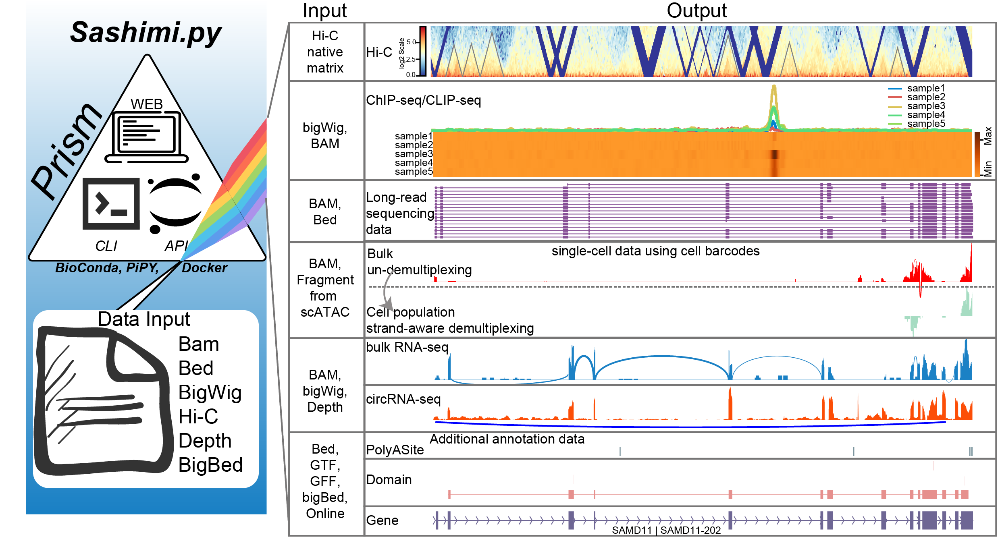

# Welcome to trackplot

[trackplot](https://github.com/ygidtu/trackplot) is a feature-rich sashimi plot framework written in pure Python.

---

## Get started

To learn trackplot, please follow the [Tutorial](https://trackplot.readthedocs.io/en/latest/command/)
