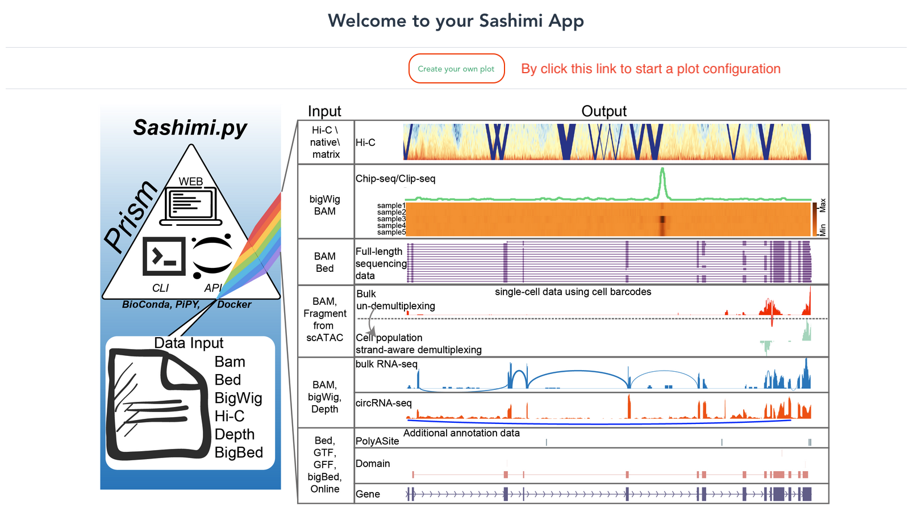
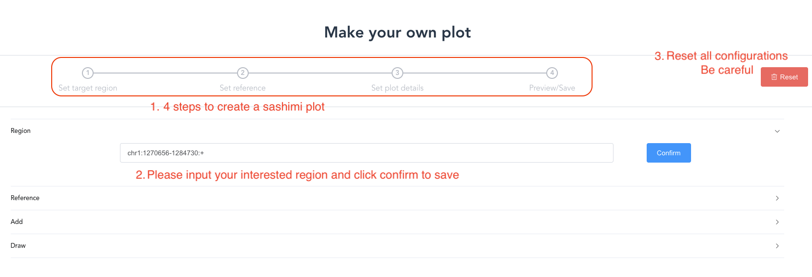
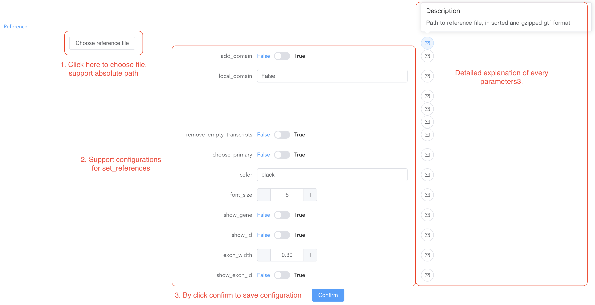
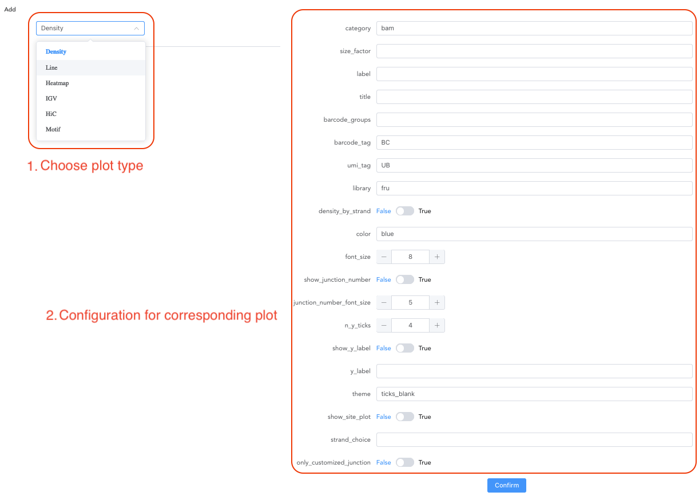
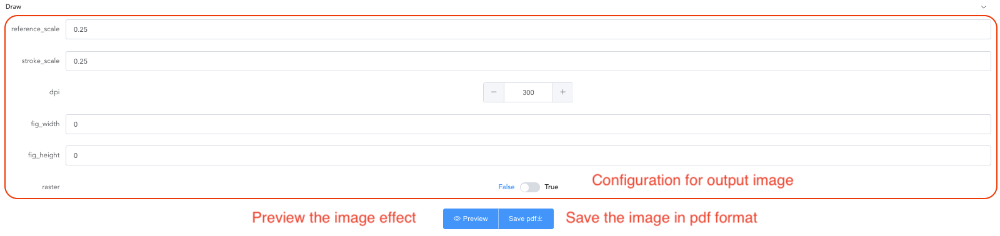
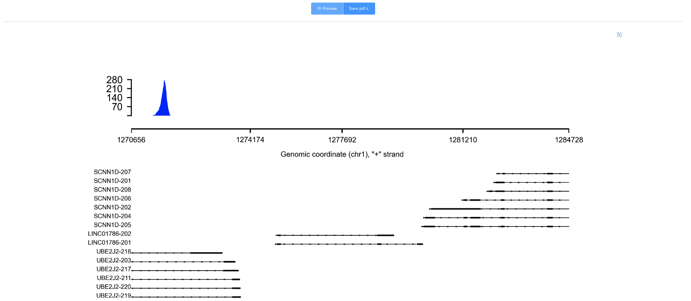

# Web UI

## Deployment
1.nodejs (18.14.0 LTS above)

Install by conda, 
```shell
conda install -c conda-forge nodejs
```
Or user could download and install nodejs from https://nodejs.org/en/

2.install from source code

```shell
git clone https://github.com/ygidtu/trackplot.git trackplot
cd trackplot/web

# build the frontend static files
npm install -g vue-cli vite && npm install
vite build

# prepare the backend server
pip install fastapi pydantic jinja2 uvicorn

# show the help document
python server.py --help

```
`-h/--host`: the ip address of the server, default: 127.0.0.1
`-p/--port` :the port of the server listening, default: 5000

Deploy the server

```
python server.py
```

3.Docker

We also prepared a docker image of web server, uses could access this by following this,

```shell

docker pull ygidtu/trackplotweb

# Deploy the server
docker run --name trackplotweb \
  --rm -v $PWD:$PWD \
  -p 5000:5000 \
  ygidtu/trackplotweb 

```

`-p`: public and private port for the server, default:5000(public):5000(private)

More information please check the [Build Web interface from source](./installation.md)

## Usage

### 1. Main page

The main page of the server, user could click the button to create the plot.



### 2. Configuration page

At this page, user could see a progress bar at the first tip indicating the progress of the current job.

And next, user should fill in the region of interest at second tip and click the confirm button for downstream analysis.

Please note that the region must follow the pattern, `chromosome_id:start_site-end_site:strand`.




At third tip, user could reset all configurations for another analysis. 
please be careful, this reset button will remove all information of previous plot.

3. Choose reference

At first, user should click the `Refernce` option to select the genomic annotation file (GTF). And GTF without sorting or bgzipping are both fine for the tool.

Then user could define the parameter at the second tip, and click the confirm button to save the current information for the next step.


here is the detailed information for each parameter.

- add_domain: whether to add domain from uniprot or local files.
- local_domain: whether add a local domain information into reference track
- interval: path to list of interval files in bed format, 1st column is path to file, 2nd column is the label
- interval_label: the label of added interval
- transcripts: the list of name or ids of transcripts to draw, like iso1,iso2
- remove_empty_transcripts: whether to remove transcripts without any exons
- color: the color of exons
- font_size: size of font
- show_gene: whether to show gene name/id
- show_id: show gene id or gene name
- reverse_minus: whether to reverse the strand of transcripts
- exon_width: the height of exons
- show_exon_id: whether to show exon id

For choosing the reference file, user could paste the absolute path of GTF or choose the file on webpage.


6. Add plot by set input file

At first, user could choose the different type of plot for each dataset, and then prepare the parameter of each tract. 

Please note that before processing another track, user should click the confirm button to save the current tract information.



here is the detailed information for each parameter of the Density track.

- category: the input file type
- size_factor:
- label: the label of input file
- title: the title of input file
- barcode_groups: key of barcode barcode_groups
- barcode_tag: cell barcode tag, `UB` tag was used in 10x dataset.
- library: fr-unstrand/fr-strand/fr-second or fru/frs/frf for short
- density_by_strand: whether to draw density plot in strand-specific manner.
- color: color for this density plot
- font_size: the font size for ticks, y-axis label and title
- show_junction_number: whether to show the number of junctions
- junction_number_font_size: the font size of junction number
- n_y_ticks: number of y ticks
- show_y_label: whether to show y-axis label
- y_label: the text of y-axis title
- theme: the build-in theme, including blank, ticks, ticks_blank
- show_site_plot: draw the density distribution of reads from different strand
- strand_choice: the strand to draw on site plot

For another track, the document of parameter refer to [here](https://trackplot.readthedocs.io/en/latest/interactive/#api-documentation). 

7. Draw the final plot

After completing our configuration,user could define the parameter for output.

In addition to output the plot, the server provide preview option for user to quickly check the current configuration.



- reference_scale: to adjust the max size of reference plot, the references only occupy at most 1/4 of figure height by default
- stroke_scale: to adjust the max size of stroke plot, the references only occupy at most 1/4 of figure height by default
- dpi: the DPI of saved plot
- width: the width of figure, if width == 0, the let matplotlib decide the size of image
- height: the height of figure, if height == 0, the let matplotlib decide the size of image
- raster: plot rasterizer site plot
- distance_between_label_axis: to adjust the distance between y-axis label and y-axis ticks

6. Preview image will display under the draw section


