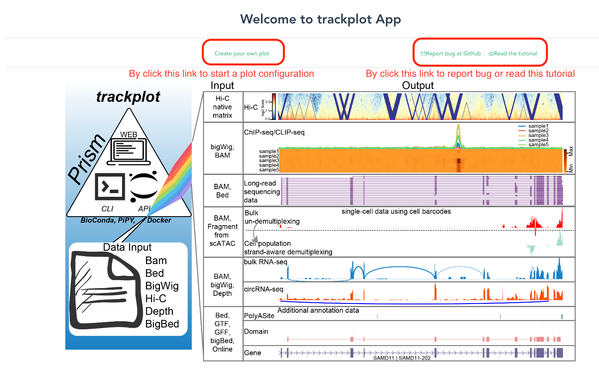
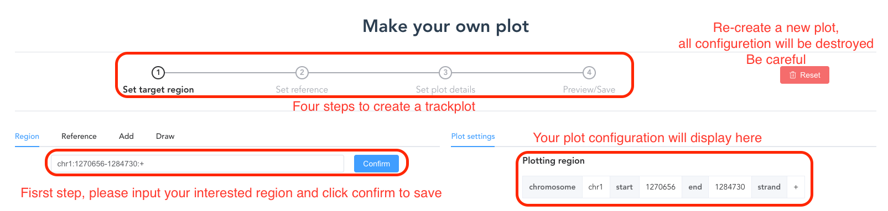
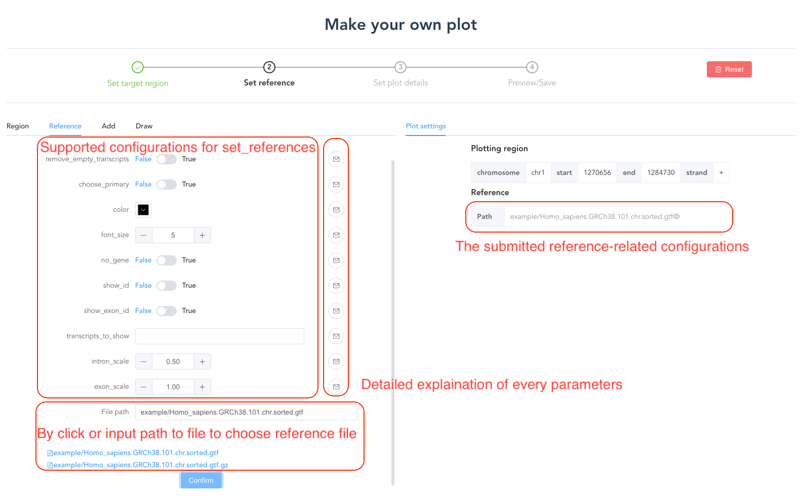
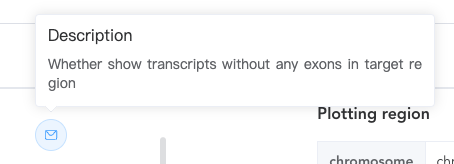
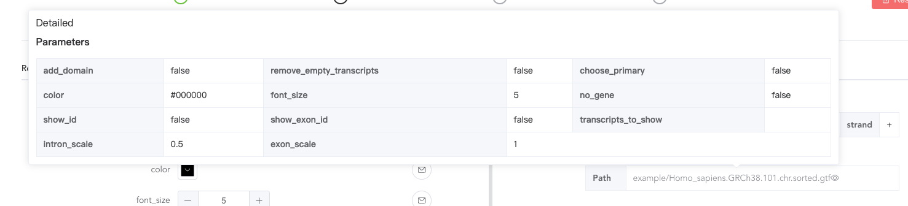
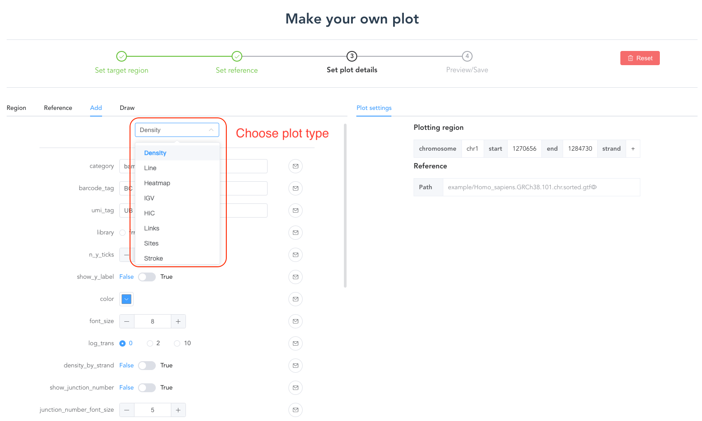
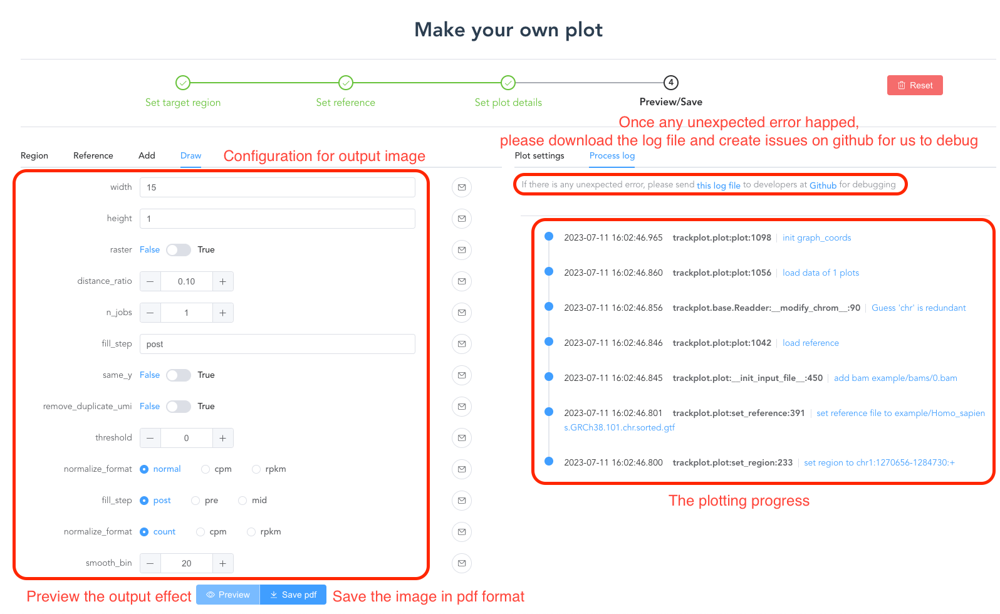
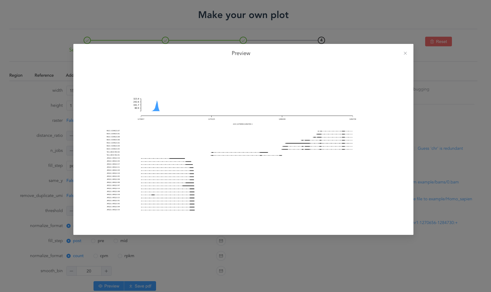

# Web UI

## Installation

### AppImage (Linux x86_64 users only)

Download the trackplotweb appimage file from our [release](https://github.com/ygidtu/trackplot/releases)

```bash
# example with version v0.2.6, please using your interested version according to your needs
export VERSION=0.2.6
chmod +x trackplotweb-${VERSION}-x86_64.AppImage
./trackplotweb-${VERSION}-x86_64.AppImage --help

# startup webserver
./trackplotweb-${VERSION}-x86_64.AppImage --host 127.0.0.1 --port 5000 --plots ./plots
```
    
**Note:** the `--plots` were required while using appimages


### Docker image (Strong recommended)

We also prepared a docker image of web server, uses could access this by following this,

```shell

docker pull ygidtu/trackplotweb

# Deploy the server
docker run --name trackplotweb \
  --rm -v $PWD:$PWD \
  -p 5000:5000 \
  ygidtu/trackplotweb 
```

`-p`: public and private port for the server, default:5000(public):5000(private)
- `-v`, `--volumn`: mount the working directory to docker container
- `--user`: prevent docker read and write file using root privileges
- the rest usage please check [Command line usage](./command.md)


### Build Web interface from source

1.nodejs (18.14.0 LTS above)

Install by conda, 
```shell
conda install -c conda-forge nodejs
```
Or user could download and install nodejs from https://nodejs.org/en/

2.install from source code

```shell
git clone https://github.com/ygidtu/trackplot.git trackplot

# install the trackplot first
cd trackplot
pip install -r requirements.txt

cd trackplot/web

# build the frontend static files
npm install -g vue-cli vite && npm install
vite build

# prepare the backend server
pip install flask

# show the help document
python server.py --help
```

`-h/--host`: the ip address of the server, default: 127.0.0.1
`-p/--port` :the port of the server listening, default: 5000
`--version`: display the current trackplot version
`--help`: show the help message

Deploy the server


## Usage

### 1. Main page

The main page of the server, user could click the button to create the plot.



### 2. Configuration page

At this page, user could see a progress bar at the first tip indicating the progress of the current job.

And next, user should fill in the region of interest at second tip and click the confirm button for downstream analysis.

Please note that the region must follow the pattern, `chromosome_id:start_site-end_site:strand`.




At third tip, user could reset all configurations for another analysis. 
please be careful, this reset button will remove all information of previous plot.

### 3. Choose reference

At first, user should click the `Refernce` option to select the genomic annotation file (GTF). And GTF without sorting or bgzipping are both fine for the tool.

Then user could define the parameter at the second tip, and click the confirm button to save the current information for the next step.
For choosing the reference file, user could paste the absolute path of GTF or choose the file on webpage.


Detailed explanation of configuration


Saved configurations


### 4. Add plot by set input file

At first, user could choose the different type of plot for each dataset, and then prepare the parameter of each tract. 



Please note that before processing another track, user should click the confirm button to save the current tract information.


For another track, the document of parameter refer to [here](https://trackplot.readthedocs.io/en/latest/interactive/#api-documentation). 

### 5. Draw the final plot

After completing our configuration,user could define the parameter for output.

In addition to output the plot, the server provide preview option for user to quickly check the current configuration.

Once unexpected error happened, users could download the log file and create and issue on GitHub for us to debug.



### 6. Preview image will display under the draw section


